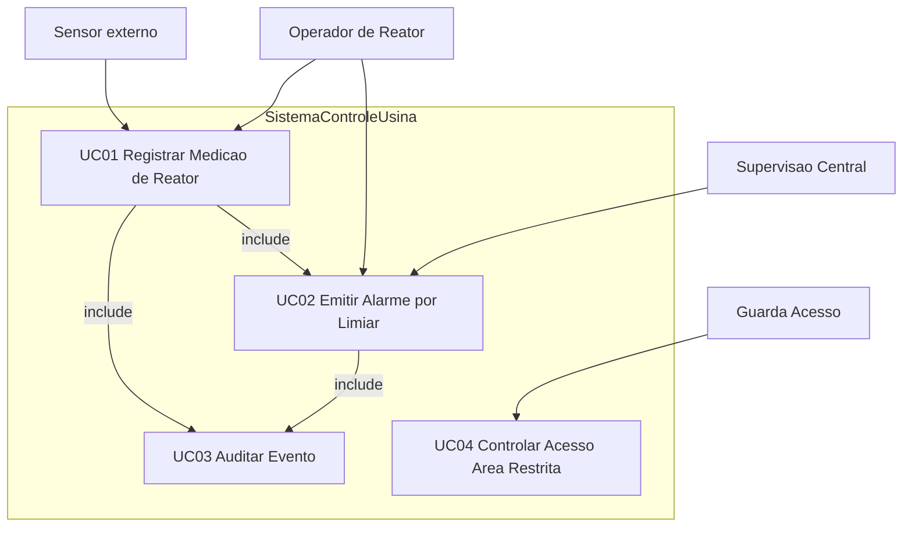

# 05 — Casos de Uso do MVP (refatorados)

**Sistema:** Controle de Usina Nuclear — RP4  
**Equipe:** Álvaro Domingues, Bruno Rocha, Bernardo Dorneles, José Guilherme Monteiro, Marcus Querol

Regras aplicadas do feedback APS (domínio usina, não militar): fluxo principal linear (sem `if`), system boundary, atores secundários explícitos, `«include»` quando o alerta é obrigatório, um UC = um objetivo.

---

## 1. Diagrama de Casos de Uso (descrição textual / Mermaid)

- **System Boundary:** `SistemaControleUsina`
- UC04 é Should (documentado; implementação Marco 3)
- UCs de evacuação/RH/materiais: backlog Won't

Fonte PlantUML: [diagramas/casos-de-uso-mvp.puml](diagramas/casos-de-uso-mvp.puml)

---

## 2. UC01 — Registrar Medição de Reator

| Campo | Conteúdo |
|-------|----------|
| Nome | Registrar Medição de Reator |
| Resumo | Persiste uma medição proveniente de sensor e dispara avaliação de limiar. |
| Ator primário | Operador de Reator (ou processo automático alimentado pelo Sensor) |
| Atores secundários | Sensor (sistema externo) |
| Pré-condições | Sensor identificado; reator cadastrado; limiares configurados |
| Pós-condições | Medição persistida; evento `MedicaoRegistrada` publicado; UC02 e UC03 incluídos quando aplicável |

### Fluxo principal (linear)

| # | Ator / Sistema | Ação |
|---|----------------|------|
| 1 | Sensor | Envia leitura (temperatura/pressão/radiação/…) |
| 2 | Sistema | Valida formato e associação Sensor–Reator |
| 3 | Sistema | `MedicaoReator.registrarMedicao(...)` |
| 4 | Sistema | Persiste via `PersistenciaReator` |
| 5 | Sistema | Publica `MedicaoRegistrada` no EventBus |
| 6 | Sistema | Inclui **UC02 Emitir Alarme por Limiar** |
| 7 | Sistema | Inclui **UC03 Auditar Evento** |
| 8 | Operador | Consulta medição no histórico |

### Fluxos alternativos / exceção

| ID | Condição | Tratamento |
|----|----------|------------|
| E1 | Leitura inválida | Sistema rejeita, registra falha de validação e **não** publica medição |
| E2 | Sensor desconhecido | Sistema rejeita e notifica Administrador |
| A1 | Limiar não violado | UC02 registra avaliação sem emitir alarme (pós-condição: sem `AlarmeEmitido`) |

---

## 3. UC02 — Emitir Alarme por Limiar

| Campo | Conteúdo |
|-------|----------|
| Nome | Emitir Alarme por Limiar |
| Resumo | Avalia medição contra limiar e, se violado, emite alarme para Operador e Supervisão Central. |
| Ator primário | Operador de Reator |
| Atores secundários | **Supervisão Central** (destinatário obrigatório do alerta) |
| Pré-condições | Medição válida disponível |
| Pós-condições | Alarme emitido e registrado **ou** avaliação registrada sem alarme (A1) |

### Fluxo principal (violação de limiar — caminho feliz do alarme)

| # | Ator / Sistema | Ação |
|---|----------------|------|
| 1 | Sistema | Obtém medição e limiar configurado |
| 2 | Sistema | Avalia limiar (`AvaliadorLimiar`) |
| 3 | Sistema | `AlarmeFactory` cria instância de `Alarme` |
| 4 | Sistema | `Alarme.emitirAlerta()` notifica **Operador** e **Supervisão Central** |
| 5 | Sistema | `Alarme.registrarEvento()` persiste ocorrência |
| 6 | Sistema | Publica `AlarmeEmitido` |
| 7 | Sistema | Inclui **UC03 Auditar Evento** |

### Alternativas

| ID | Condição | Tratamento |
|----|----------|------------|
| A1 | Limiar respeitado | Sistema registra avaliação OK e encerra sem notificação de alarme |
| E1 | Falha ao notificar Supervisão | Sistema registra falha de entrega e mantém alarme persistido para reenvio |

---

## 4. UC03 — Auditar Evento

| Campo | Conteúdo |
|-------|----------|
| Nome | Auditar Evento |
| Resumo | Grava trilha append-only de evento de domínio relevante. |
| Ator primário | Sistema (automático) |
| Atores secundários | — |
| Pré-condições | Evento publicado no barramento |
| Pós-condições | `RegistroAuditoria` persistido |

### Fluxo principal

| # | Ação do sistema |
|---|-----------------|
| 1 | Consome evento do EventBus |
| 2 | Normaliza payload (tipo, timestamp, origem) |
| 3 | Persiste `RegistroAuditoria` |
| 4 | Confirma consumo |

### Exceção

| ID | Condição | Tratamento |
|----|----------|------------|
| E1 | Falha de persistência de auditoria | Log local de erro; **não** interrompe ControleReator (RNF02/RNF04) |

---

## 5. UC04 — Controlar Acesso a Área Restrita (Should)

| Campo | Conteúdo |
|-------|----------|
| Nome | Controlar Acesso a Área Restrita |
| Resumo | Valida credencial e registra resultado em `RegistroAcesso`. |
| Ator primário | Guarda / Controle de Acesso |
| Atores secundários | Operador (quando notificado de tentativa negada em área crítica) |
| Pré-condições | Área e credencial cadastradas |
| Pós-condições | `RegistroAcesso` persistido |

### Fluxo principal (acesso autorizado)

| # | Ator / Sistema | Ação |
|---|----------------|------|
| 1 | Guarda | Apresenta credencial no ponto de acesso |
| 2 | Sistema | Valida credencial e nível da área |
| 3 | Sistema | Autoriza entrada |
| 4 | Sistema | `RegistroAcesso.registrar(...)` com resultado SUCESSO |
| 5 | Sistema | Publica `AcessoRegistrado` (opcional) e inclui UC03 |

### Alternativa

| ID | Condição | Tratamento |
|----|----------|------------|
| A1 | Credencial inválida ou nível insuficiente | Nega acesso; `RegistroAcesso` com FALHA; notifica Operador se área crítica |

---

## 6. Backlog de UCs (não documentados em detalhe no Marco 1)

- Ativar Protocolo de Contingência (Could) — exige `Emergencia.criarEmergencia` + `ProtocoloEmergencia`
- Rastrear Materiais, Evacuação, RH, Relatórios — Won't
