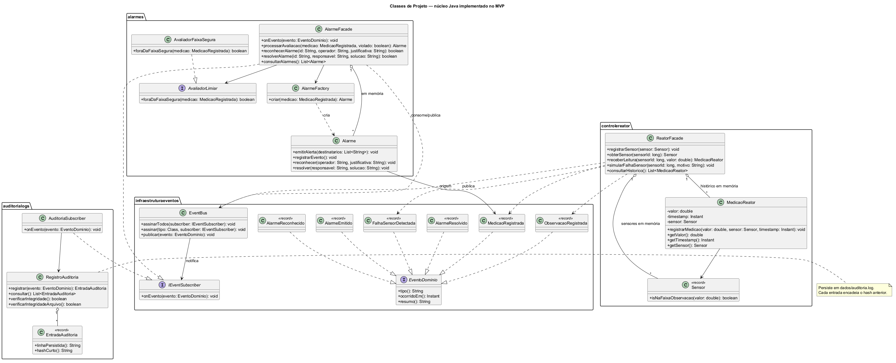

# 06 — Diagrama de Classes de Projeto (núcleo MVP)

**Sistema:** Controle de Usina Nuclear — RP4  
**Equipe:** Álvaro Domingues, Bruno Rocha, Bernardo Dorneles, José Guilherme Monteiro, Marcus Querol

Este documento descreve somente as classes que existem no núcleo Java atual. Classes futuras não aparecem no diagrama ativo para não repetir a inconsistência apontada pelo professor entre UML e código.

Fonte UML: [diagramas/classes-projeto-mvp.puml](diagramas/classes-projeto-mvp.puml)



---

## 1. Infraestrutura de eventos

| Classe | Responsabilidade | Métodos principais |
|--------|------------------|--------------------|
| `EventoDominio` | Contrato comum dos fatos publicados | `tipo()`, `ocorridoEm()`, `resumo()` |
| `IEventSubscriber` | Contrato de consumo | `onEvento(EventoDominio)` |
| `EventBus` | Observer/Pub-Sub síncrono e in-process | `assinarTodos(...)`, `assinar(...)`, `publicar(...)` |
| Eventos concretos | Dados imutáveis representados por records | `MedicaoRegistrada`, `ObservacaoRegistrada`, `FalhaSensorDetectada`, `AlarmeEmitido`, `AlarmeReconhecido`, `AlarmeResolvido` |

O `EventBus` isola exceções por assinante, mas não oferece fila, retenção ou entrega assíncrona nesta versão.

## 2. Controle de reator

| Classe | Responsabilidade | Métodos principais |
|--------|------------------|--------------------|
| `ReatorFacade` | Fachada para sensores, leituras e falhas simuladas | `registrarSensor`, `receberLeitura`, `simularFalhaSensor`, `consultarHistorico` |
| `Sensor` | Record com tipo, unidade e faixas operacional/de observação | `isNaFaixaObservacao` |
| `MedicaoReator` | Entidade de medição associada a um sensor | `registrarMedicao`, `getValor`, `getTimestamp`, `getSensor` |

Sensores e histórico de medições são mantidos em memória pela `ReatorFacade`. Não existe `ReatorRepository` no código atual.

## 3. Alarmes

| Classe | Padrão/responsabilidade | Métodos principais |
|--------|-------------------------|--------------------|
| `AlarmeFacade` | Facade e subscriber de `MedicaoRegistrada` | `onEvento`, `processarAvaliacao`, `reconhecerAlarme`, `resolverAlarme`, `consultarAlarmes` |
| `AvaliadorLimiar` | Strategy | `foraDaFaixaSegura` |
| `AvaliadorFaixaSegura` | Implementação da Strategy | `foraDaFaixaSegura` |
| `AlarmeFactory` | Factory | `criar(MedicaoRegistrada)` |
| `Alarme` | Entidade e ciclo de vida do alarme | `emitirAlerta`, `registrarEvento`, `reconhecer`, `resolver` |

Os alarmes ficam em memória durante a execução. O registro durável correspondente ocorre por meio dos eventos consumidos pela auditoria.

## 4. Auditoria

| Classe | Responsabilidade | Métodos principais |
|--------|------------------|--------------------|
| `AuditoriaSubscriber` | Subscriber global do EventBus | `onEvento` |
| `RegistroAuditoria` | Persistência append-only e verificação da cadeia SHA-256 | `registrar`, `consultar`, `verificarIntegridade`, `verificarIntegridadeArquivo` |
| `EntradaAuditoria` | Record persistido no log | `linhaPersistida`, `hashCurto` |

A cadeia SHA-256 torna adulterações detectáveis; ela não impede que o arquivo físico seja alterado.

## 5. Regras de consistência

1. Toda mensagem nos diagramas SEQ-UC01 e SEQ-UC02 corresponde a um método existente.
2. O diagrama não apresenta banco, repository, broker externo ou API HTTP como implementados.
3. Operador de Reator e Supervisão Central são destinatários explícitos do alarme.
4. Funcionalidades Should/Could permanecem nos requisitos e backlog, fora do diagrama de classes implementadas.

## 6. Relacionamentos principais

```text
ReatorFacade 1 o-- * Sensor
ReatorFacade 1 o-- * MedicaoReator
MedicaoReator * --> 1 Sensor
AlarmeFacade 1 o-- * Alarme
Alarme * --> 1 MedicaoRegistrada
EventBus --> IEventSubscriber
AuditoriaSubscriber --> RegistroAuditoria --> EntradaAuditoria
```
