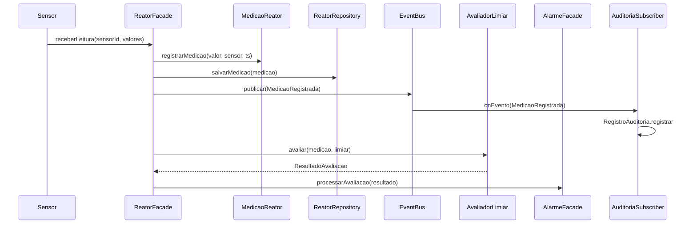
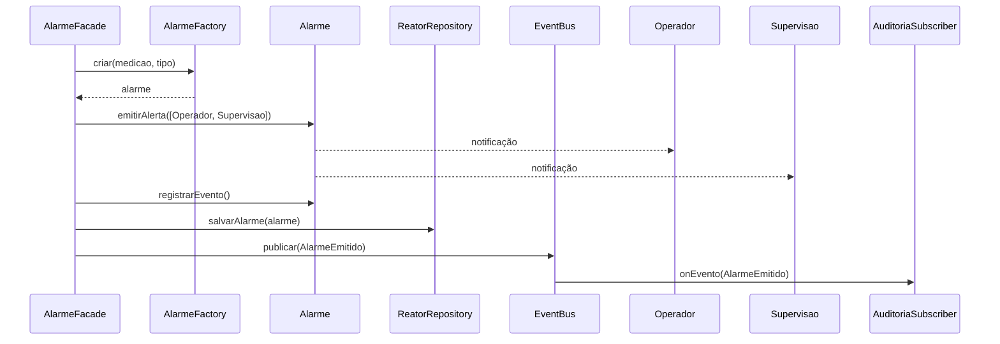

# 07 — Diagramas de Sequência (núcleo MVP)

**Sistema:** Controle de Usina Nuclear — RP4  
**Equipe:** Álvaro Domingues, Bruno Rocha, Bernardo Dorneles, José Guilherme Monteiro, Marcus Querol

Todas as mensagens referenciam métodos existentes em [06-classes-projeto-mvp.md](06-classes-projeto-mvp.md).

Fontes PlantUML: [diagramas/seq-uc01-medicao.puml](diagramas/seq-uc01-medicao.puml), [diagramas/seq-uc02-alarme.puml](diagramas/seq-uc02-alarme.puml)

---

## SEQ-UC01 — Registrar Medição (fluxo principal até include de alarme)

---

## SEQ-UC02 — Emitir Alarme (limiar violado)

---

## SEQ-UC02-A1 — Limiar não violado (alternativa)

1. `AlarmeFacade.processarAvaliacao` recebe `isViolado() == false`
2. Facade encerra sem `emitirAlerta`
3. Opcional: publica `AvaliacaoLimiarOk` para auditoria

---

## SEQ-UC04 (Should — rascunho)

`Guarda -> AcessoFacade.solicitarAcesso -> RegistroAcesso.registrar -> EventBus`  
Implementação e desenho detalhado no Marco 3.
