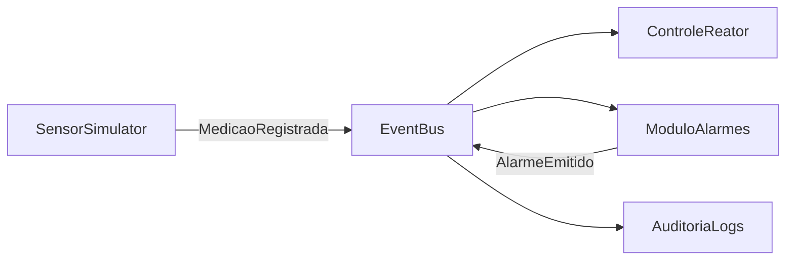
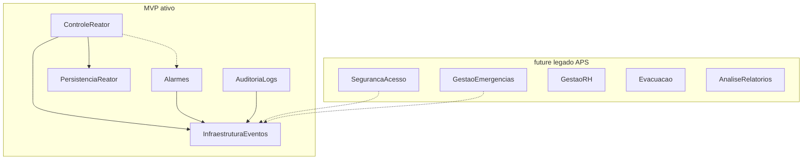

# Entrega Marco 1 — RP4 (AL0343)

**Sistema de Controle de Usina Nuclear**  
**Universidade Federal do Pampa — Campus Alegrete**  
**Repositório:** https://github.com/rlampago22/RP-IV

## Equipe

| Integrante |
|------------|
| Álvaro Domingues |
| Bruno Rocha |
| Bernardo Dorneles |
| José Guilherme Monteiro |
| Marcus Querol |

**Arquitetura:** Orientada a Eventos (EDA) + módulos independentes + persistência dedicada (**mantida** do legado APS).

---

## Sumário da entrega

Este documento consolida o que o professor pediu para a segunda-feira (recuperação / Marco 1):

1. Lista de requisitos funcionais e não funcionais  
2. Priorização (MoSCoW)  
3. Proposta de MVP  
4. Projeto refatorado: pacotes + componentes lógicos + componentes físicos  
5. Artefatos adicionais necessários: UCs, classes, sequências, ER do núcleo  
6. Checklist de correções dos feedbacks APS  

Fontes detalhadas em Markdown/PlantUML na pasta `docs/marco1/`.

---

## 1. Requisitos Funcionais e Não Funcionais

Ver documento completo: [01-requisitos-rf-rnf.md](01-requisitos-rf-rnf.md)

### RF (resumo Must)

| ID | Requisito |
|----|-----------|
| RF01 | Coletar medições de reator |
| RF02 | Histórico operacional |
| RF03 | Avaliar limiares |
| RF04 | Emitir alarme (Operador + Supervisão Central) |
| RF05 | Registrar evento de alarme |
| RF06 | Auditar eventos |

### RNF (resumo)

RNF01 Desempenho · RNF02 Confiabilidade · RNF03 Integridade · RNF04 Tolerância a falhas · RNF05 Auditabilidade · RNF06 Manutenibilidade · RNF07 Escalabilidade · RNF08 Segurança · RNF09 Persistência segura do núcleo · RNF10 Testabilidade — todos justificados pela EDA em [04-arquitetura-eda.md](04-arquitetura-eda.md).

---

## 2. Priorização MoSCoW

Ver: [02-priorizacao-moscow.md](02-priorizacao-moscow.md)

| Faixa | Conteúdo |
|-------|----------|
| **Must** | RF01–RF06 + artefatos de projeto do núcleo |
| **Should** | RF07–RF08 Controle de acesso (`RegistroAcesso`) |
| **Could** | RF09–RF10 Emergência + `ProtocoloEmergencia` |
| **Won't** | Evacuação, RH, conformidade ampla, IA, microserviços reais |

---

## 3. Proposta de MVP

Ver: [03-proposta-mvp.md](03-proposta-mvp.md)

Fluxo demonstrável:



- **Marco 1:** documentação + esqueleto Java  
- **Marco 2:** implementação Must + GoF  
- **Marco 3:** Should (acesso) ou Could (contingência)

---

## 4. Projeto arquitetural refatorado

### 4.1 Justificativa EDA

Ver: [04-arquitetura-eda.md](04-arquitetura-eda.md)

### 4.2 Diagrama de pacotes

Fonte: [diagramas/pacotes.puml](diagramas/pacotes.puml)



### 4.3 Componentes lógicos

Fonte: [diagramas/componentes-logicos.puml](diagramas/componentes-logicos.puml)

Pacotes com Facade + entidades corrigidas (`MedicaoReator.registrarMedicao`, `Alarme.emitirAlerta` / `registrarEvento`) + portas `IEventPublisher` / `IEventSubscriber`.

### 4.4 Componentes físicos (executável)

Fonte: [diagramas/componentes-fisicos.puml](diagramas/componentes-fisicos.puml)

Artefatos: `usina-controle-mvp.jar`, `application.properties`, driver DB, `event-bus`, base `reator.db`.

---

## 5. Casos de uso, classes e sequências

| Artefato | Arquivo |
|----------|---------|
| UCs MVP | [05-casos-uso-mvp.md](05-casos-uso-mvp.md) |
| Diagrama UC | [diagramas/casos-de-uso-mvp.puml](diagramas/casos-de-uso-mvp.puml) |
| Classes projeto | [06-classes-projeto-mvp.md](06-classes-projeto-mvp.md) |
| PlantUML classes | [diagramas/classes-projeto-mvp.puml](diagramas/classes-projeto-mvp.puml) |
| Sequências | [07-sequencias-mvp.md](07-sequencias-mvp.md) |
| SEQ PlantUML | [diagramas/seq-uc01-medicao.puml](diagramas/seq-uc01-medicao.puml), [diagramas/seq-uc02-alarme.puml](diagramas/seq-uc02-alarme.puml) |

Pontos de correção APS aplicados: system boundary, include de alarme/auditoria, destinatários explícitos, sem `if` no fluxo principal, métodos/classes das sequências presentes no diagrama de classes.

---

## 6. Mapeamento relacional (núcleo)

Ver: [08-mapeamento-relacional-mvp.md](08-mapeamento-relacional-mvp.md) · [diagramas/er-nucleo-mvp.puml](diagramas/er-nucleo-mvp.puml)

Correções: enums → tabelas; `VARCHAR`; FKs Sensor/Medicao/Alarme/Turbina→Reator; sem N:N injustificado no núcleo.

---

## 7. Checklist de feedback APS

Ver: [checklist-feedback-aps.md](checklist-feedback-aps.md)

---

## 8. Esqueleto de código

Pacotes Java em `src/main/java/br/edu/unipampa/usina/` espelhando a arquitetura. Classes com métodos exigidos pelo feedback já declarados; corpo funcional no Marco 2.

---

## 9. Como gerar PDF desta entrega

Opção A — exportar este arquivo + anexos pelo VS Code / Typora / Pandoc:

```bash
pandoc docs/marco1/ENTREGA-MARCO1.md -o docs/marco1/ENTREGA-MARCO1.pdf --resource-path=docs/marco1
```

Opção B — abrir os `.puml` em https://www.plantuml.com/plantuml ou extensão PlantUML e colar as imagens no PDF final da equipe.

Opção C — entregar o link do GitHub + este Markdown (conforme orientação do professor).

---

## 10. Próximos passos (Marco 2)

1. Implementar `EventBus` real in-process  
2. Simulador de sensores → `ReatorFacade.receberLeitura`  
3. Strategy de limiar + Factory/Facade de alarme  
4. Persistência H2/SQLite  
5. Demonstração ponta a ponta no README  
