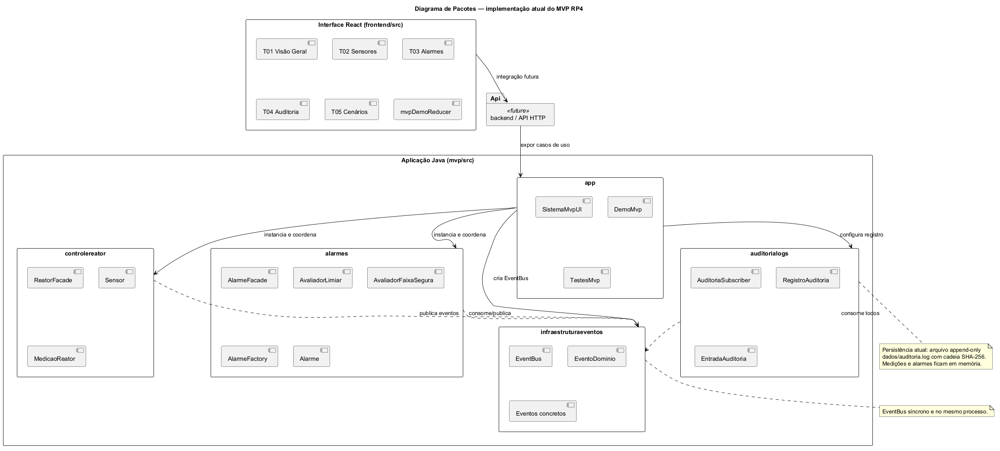
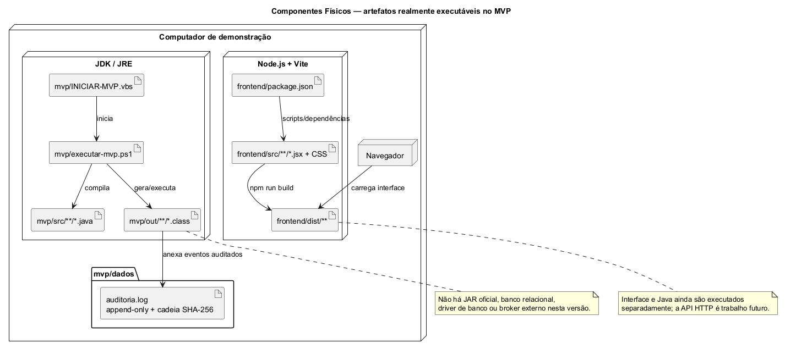

# Entrega Marco 1 — RP4 (AL0343)

**Sistema de Controle de Usina Nuclear**  
**Universidade Federal do Pampa — Campus Alegrete**  
**Repositório:** https://github.com/rlampago22/RP-IV

## Equipe

| Integrante |
|------------|
| Álvaro Domingues |
| Bruno Rocha |
| Bernardo Dorneles |
| José Guilherme Monteiro |
| Marcus Querol |

**Arquitetura:** Orientada a Eventos (EDA) in-process + módulos independentes + auditoria persistente em arquivo.

---

## Sumário da entrega

Este documento consolida o que o professor pediu para a segunda-feira (recuperação / Marco 1):

1. Lista de requisitos funcionais e não funcionais  
2. Priorização (MoSCoW)  
3. Proposta de MVP  
4. Projeto refatorado: pacotes + componentes lógicos + componentes físicos  
5. Artefatos adicionais necessários: UCs, classes, sequências, ER do núcleo  
6. Checklist de correções dos feedbacks APS  

Fontes detalhadas em Markdown, Astah e PlantUML na pasta `docs/marco1/` e em `docs/marcus/diagramas/`.

---

## 1. Requisitos Funcionais e Não Funcionais

Ver documento completo: [01-requisitos-rf-rnf.md](01-requisitos-rf-rnf.md)

### RF (resumo Must)

| ID | Requisito |
|----|-----------|
| RF01 | Coletar medições de reator |
| RF02 | Histórico operacional |
| RF03 | Avaliar limiares |
| RF04 | Emitir alarme (Operador + Supervisão Central) |
| RF05 | Registrar evento de alarme |
| RF06 | Auditar eventos |

### RNF (resumo)

RNF01 Desempenho · RNF02 Confiabilidade · RNF03 Integridade · RNF04 Tolerância a falhas · RNF05 Auditabilidade · RNF06 Manutenibilidade · RNF07 Escalabilidade · RNF08 Segurança · RNF09 Persistência segura do núcleo · RNF10 Testabilidade — todos justificados pela EDA em [04-arquitetura-eda.md](04-arquitetura-eda.md).

---

## 2. Priorização MoSCoW

Ver: [02-priorizacao-moscow.md](02-priorizacao-moscow.md)

| Faixa | Conteúdo |
|-------|----------|
| **Must** | RF01–RF06 + artefatos de projeto do núcleo |
| **Should** | RF07–RF08 Controle de acesso (`RegistroAcesso`) |
| **Could** | RF09–RF10 Emergência + `ProtocoloEmergencia` |
| **Won't** | Evacuação, RH, conformidade ampla, IA, microserviços reais |

---

## 3. Proposta de MVP

Ver: [03-proposta-mvp.md](03-proposta-mvp.md)

Fluxo demonstrável:


Fonte UML: [diagramas/componentes-logicos-mvp.puml](diagramas/componentes-logicos-mvp.puml). O `EventBus` implementado é síncrono e executado no mesmo processo Java.

- **Marco 1:** documentação e esqueleto Java
- **Marco 2:** fluxo Must funcional, GoF e auditoria persistente
- **Marco 3:** interface React T01–T05, integração HTTP e preparação da demonstração

---

## 4. Projeto arquitetural refatorado

### 4.1 Justificativa EDA

Ver: [04-arquitetura-eda.md](04-arquitetura-eda.md)

### 4.2 Diagrama de pacotes

Fonte: [diagramas/pacotes.puml](diagramas/pacotes.puml)



### 4.3 Componentes lógicos

Fonte: [diagramas/componentes-logicos.puml](diagramas/componentes-logicos.puml)


Componentes com Facade, Observer/Pub-Sub, Strategy e Factory, além do estado compartilhado das telas T01–T05. A integração HTTP entre React e Java está marcada como futura.

### 4.4 Componentes físicos (executável)

Fonte: [diagramas/componentes-fisicos.puml](diagramas/componentes-fisicos.puml)



Artefatos reais: fontes e classes Java, scripts de execução, log de auditoria, fontes React e build Vite. Não há JAR oficial, banco relacional, driver de banco ou broker externo nesta versão.

---

## 5. Casos de uso, classes e sequências

| Artefato | Arquivo |
|----------|---------|
| UCs MVP | [05-casos-uso-mvp.md](05-casos-uso-mvp.md) |
| Diagrama UC | [Astah editável](../marcus/diagramas/Marcus-UML-MVP.asta) e [PNG](../marcus/diagramas/Marcus-UML-MVP/01%20-%20Casos%20de%20Uso%20MVP.png) |
| Classes projeto | [06-classes-projeto-mvp.md](06-classes-projeto-mvp.md) |
| PlantUML classes | [diagramas/classes-projeto-mvp.puml](diagramas/classes-projeto-mvp.puml) |
| Sequências | [07-sequencias-mvp.md](07-sequencias-mvp.md) |
| Sequências UML | [Astah editável](../marcus/diagramas/Marcus-UML-MVP.asta), [SEQ-UC01](../marcus/diagramas/Marcus-UML-MVP/02%20-%20SEQ%20UC01%20Registrar%20Medição.png) e [SEQ-UC02](../marcus/diagramas/Marcus-UML-MVP/03%20-%20SEQ%20UC02%20Emitir%20Alarme.png) |

Pontos de correção APS aplicados: system boundary, include de alarme/auditoria, destinatários explícitos, sem `if` no fluxo principal, métodos/classes das sequências presentes no diagrama de classes.

---

## 6. Mapeamento relacional (núcleo)

Ver: [08-mapeamento-relacional-mvp.md](08-mapeamento-relacional-mvp.md) · [diagramas/er-nucleo-mvp.puml](diagramas/er-nucleo-mvp.puml)

Correções: enums → tabelas; `VARCHAR`; FKs Sensor/Medicao/Alarme/Turbina→Reator; sem N:N injustificado no núcleo.

---

## 7. Checklist de feedback APS

Ver: [checklist-feedback-aps.md](checklist-feedback-aps.md)

---

## 8. Esqueleto de código

O núcleo funcional está em `mvp/src/br/edu/unipampa/usina/`, com EventBus, controle de reator, alarmes e auditoria. A pasta `src/` permanece como legado do esqueleto inicial.

---

## 9. Como gerar PDF desta entrega

Opção A — exportar este arquivo + anexos pelo VS Code / Typora / Pandoc:

```bash
pandoc docs/marco1/ENTREGA-MARCO1.md -o docs/marco1/ENTREGA-MARCO1.pdf --resource-path=docs/marco1
```

Opção B — abrir os `.puml` em https://www.plantuml.com/plantuml ou extensão PlantUML e colar as imagens no PDF final da equipe.

Opção C — entregar o link do GitHub + este Markdown (conforme orientação do professor).

---

## 10. Próximos passos (Marco 2)

1. Criar API HTTP Java para ligar o React ao núcleo EDA
2. Substituir o estado demonstrativo do React por dados reais da API
3. Decidir persistência de medições/alarmes e documentar a escolha
4. Polir testes, roteiro e evidências da demonstração
5. Manter Astah, documentação e código sincronizados
