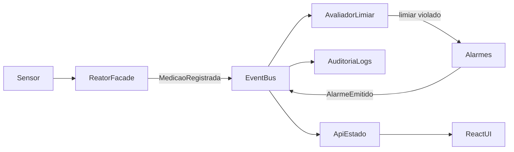

# Como o sistema funciona e como entregamos

**Arquitetura (única):** EDA — EventBus Java in-process.  
**Stack:** Backend Java (`mvp/` hoje) + Frontend React (`frontend/`).  
**UI oficial:** web **Opção A — SCADA escuro** ([`ui/direcao-opcao-a.md`](ui/direcao-opcao-a.md), protótipo [`ui/propostas/opcao-a.html`](ui/propostas/opcao-a.html)) — Swing é legado de fluxo.

---

## 1. Fluxo do MVP (Must)

| Camada | O que faz |
|--------|-----------|
| Domínio Java | Publica/consome eventos; persiste núcleo |
| API (a evoluir) | Expõe estado derivado dos eventos ao front |
| React | Telas T01–T05 de supervisão |

Telas: ver [`ui/idealizacao-telas.md`](ui/idealizacao-telas.md).

---

## 2. Regra de entrega semanal (vertical)

Toda **segunda** cada aluno entrega **1 issue** com:

1. **Backend** (Java / evento / doc de arquitetura da trilha)  
2. **Frontend** (pedaço da tela React T0X ou Figma → código)  
3. Relatório no template [`semanas/_template-entrega-vertical.md`](semanas/_template-entrega-vertical.md)  
4. PR da branch pessoal → `desenvolvimento`

Ao fechar a sprint: preencher [`semanas/_template-resumo-merge.md`](semanas/_template-resumo-merge.md).

| Aluno | Branch | Back (trilha) | Front (tela) |
|-------|--------|---------------|--------------|
| Álvaro | `alvaro` | Aceite, RF/MoSCoW, checklist | Critérios UX / validação T0X |
| Bruno | `bruno` | EventBus, pacotes/componentes, API eventos | T01 Overview (shell + dados) |
| Bernardo | `bernardo` | Medições / histórico | T02 Sensores |
| José | `jose` | Alarmes / limiar / GoF | T03 Alarmes |
| Marcus | `marcus` | Auditoria / UCs-SEQ | T04 Auditoria (+ apoio T05 Demo) |

---

## 3. Calendário até Marco 1

| Sprint | Segunda | Foco do grupo | Issues |
|--------|---------|---------------|--------|
| Idealização | **agora → 21/09** | Opção A no Figma + shell React (#40) | Epic [#40](https://github.com/rlampago22/RP-IV/issues/40) |
| S3 | **21/09** | 1ª fatia vertical back+front por pessoa | 5 issues S3 |
| S4 | **28/09** | Integração, polish, ensaio 8–10 min | 5 issues S4 |
| Marco 1 | **05/10** | Apresentação + demo Must | 5 issues M1 |

### DoD S3 (21/09)
Cada um com PR: domínio da trilha **e** tela React mínima (mesmo mock). Eventos da trilha documentados.

### DoD S4 (28/09)
Fluxo integrado: demo dispara cenário → overview/alarmes/auditoria atualizam. README de execução. Diagramas essenciais = código real.

### DoD Marco 1 (05/10)
Apresentação: EDA + MVP Must + demo web (ou híbrido web+Java se API ainda parcial) + artefatos UML essenciais.

---

## 4. Débito técnico a não esquecer

| Item | Dono |
|------|------|
| Evidência S1 pacotes/componentes | Bruno |
| Evidência S1 GoF | José |
| API HTTP Java → React | Bruno (+ apoio) |
| Figma frames oficiais | Grupo (plugin Figma no Cursor) |
| Migrar `mvp/` → `backend/` | Contínuo |

---

## 5. O que NÃO fazer até Marco 1

Evacuação, RH, IA preditiva, conformidade ampla, microserviços, visual Swing como entrega final.
